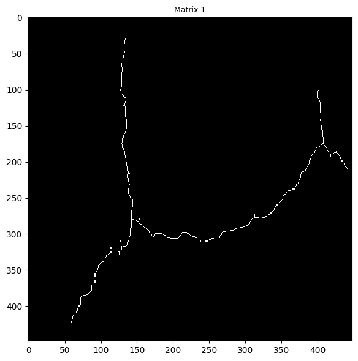
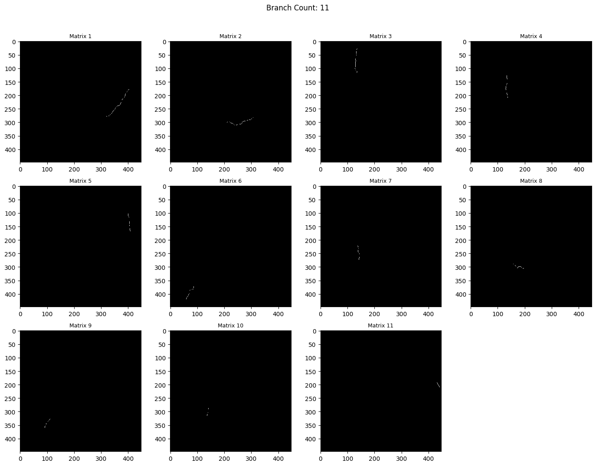
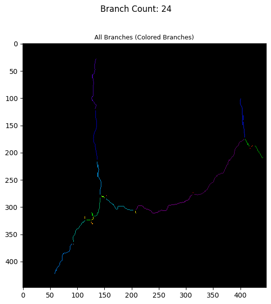
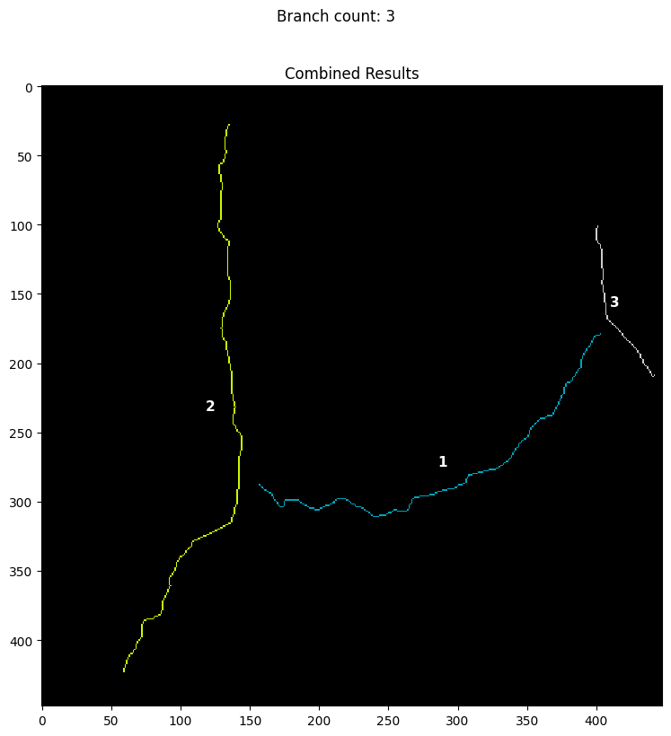
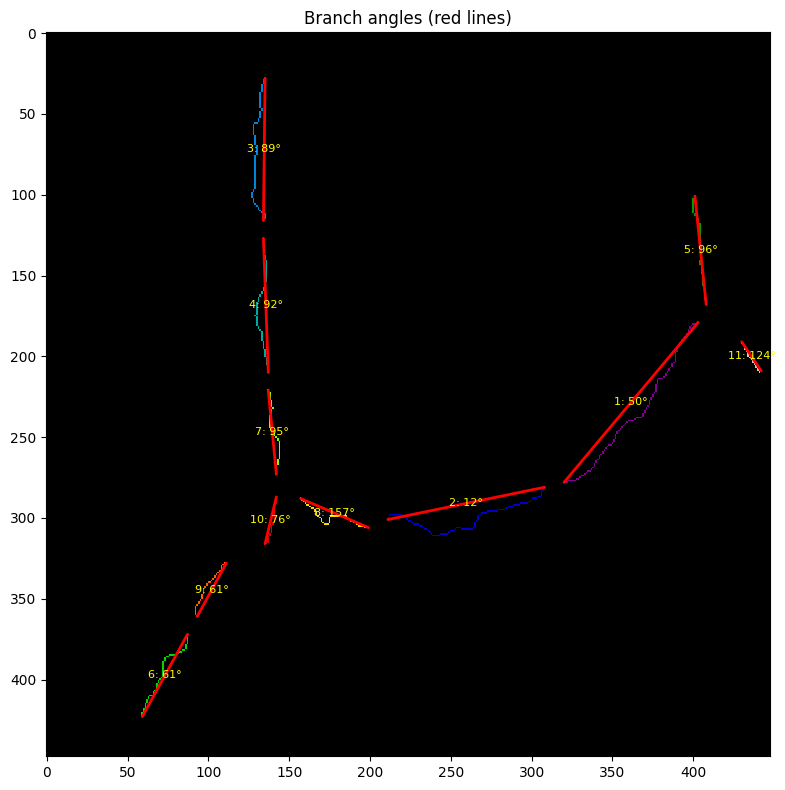

# InfraDrone Engine

InfraDrone analyzes road imagery, typically from drones, to find pavement damage and measure it from model outputs. The current engine combines YOLO-based detection and segmentation with image post-processing to turn raw frames into structured damage records.

## How it works

```
Drone / camera image
        │
        ▼
  Preprocessing (resize, CLAHE, denoise)
        │
        ▼
  Detection (YOLO26s)
  "Where are cracks/potholes?"
        │
        ▼
  Crop detected regions
        │
        ▼
  Segmentation (YOLO26s-seg)
  "What is the exact crack shape?"
        │
        ▼
  Post-processing & domain mapping
  (class, subtype, dimensions, confidence)
        │
        ▼
  Severity / simulation layer
  (planned, not yet implemented)
        │
        ▼
  Damage report
```

### 1. Preprocessing

Images are enhanced before inference to handle outdoor lighting, noise, and varying resolution:

- **Resize** to the model input size
- **CLAHE** (contrast-limited adaptive histogram equalization) to bring out surface detail
- **Denoising** to reduce compression and sensor noise

This pipeline lives in `src/engine/preprocessing.py` and is shared between training and inference.

### 2. Detection model (YOLO26s)

The detection model finds **bounding boxes** for road defects. It is trained on the [RDD2022](https://github.com/seunghoonpark/RDD2022)-style dataset with two classes:

| Class ID | Label   |
|----------|---------|
| 0        | crack   |
| 1        | pothole |

Training config: `src/ml/configs/train.yaml` → `detection`  
Training script: `src/ml/scripts/detection/train_model.py`  
Dataset: `datasets/detection/RD2022/`

The `DetectionEngine` in `src/engine/detection.py` runs: **preprocess → infer → post-process**.

### 3. Segmentation model (YOLO26s-seg)

The segmentation model produces **pixel-level crack masks**, which are used for finer measurements (length, width, orientation, branching) that bounding boxes alone cannot capture.

Training config: `src/ml/configs/train.yaml` → `segmentation`  
Training script: `src/ml/scripts/segmentation/train_model.py`  
Dataset: `datasets/segmentation/crack_segmentation_dataset/`

Mask annotations are generated from binary masks via `src/ml/scripts/segmentation/convert_images_masks.py`.

The `SegmentationEngine` in `src/engine/segmentation.py` returns measured `Damage` records for each detected region.

### 4. Domain model

Raw model outputs are mapped into structured `Damage` objects defined in `src/engine/models.py`:

- **Type** — crack or pothole
- **Subtype** — e.g. longitudinal / transverse / alligator crack, or pothole size
- **Dimensions** — width and length with unit conversion (cm / inch)
- **Confidence** — model score
- **Stress range** — road class (residential → freeway), used by the fatigue model
- **Severity** — currently a placeholder value; severity scoring is still being built

Constants and enums live in `src/engine/constants.py`.

### 5. Physical simulation (Paris' Law)

Paris' Law models **fatigue crack growth** under repeated stress:

```
da/dN = C · (ΔK)^m
```

Where crack length grows per load cycle as a function of stress intensity. InfraDrone is designed to use this to estimate how an observed defect may worsen over time given the road's traffic/stress category (`StressRange` in `constants.py`).

> **Note:** The top-level `Engine` class wires detection and segmentation together. Paris' Law integration, severity scoring, backend persistence, and full prediction output are still being built out.

## Pipeline Results

The screenshots below show intermediate outputs from the segmentation post-processing pipeline. They focus on the crack-analysis stage after a detected damage region has been segmented.

### Skeletonized mask



The segmentation mask is reduced to a one-pixel-wide skeleton. This preserves the crack's centerline so the engine can estimate length, find endpoints, and identify branch points without measuring the full mask thickness at every step.

### Split branches



After skeletonization, the engine separates the crack network into individual branches. This makes each branch easier to measure and classify independently before nearby fragments are merged back together.

### Colored branch labels



Each detected branch is assigned a separate color. This view is useful for checking whether the branch-finding logic is over-splitting a continuous crack or grouping unrelated crack fragments together.

### Combined branch results



Nearby and similarly aligned branches can be merged into larger crack paths. The numbered labels show the final branch groups that are passed into measurement and subtype classification.

### Branch angle estimates



The red guide lines show each branch's estimated axis angle. These angles help classify cracks as longitudinal or transverse based on their orientation in the image.

## Project layout

```
src/
├── engine/          # Inference pipeline, preprocessing, domain types
│   ├── base.py
│   ├── config.yaml
│   ├── constants.py
│   ├── detection.py
│   ├── engine.py
│   ├── models.py
│   ├── preprocessing.py
│   ├── segmentation.py
│   └── utils.py
└── ml/
    ├── configs/     # Shared train.yaml for both models
    ├── scripts/
    │   ├── detection/
    │   └── segmentation/
    ├── models/      # YOLO architecture configs and weights
    └── runs/        # Training outputs (Ultralytics + W&B)

datasets/
├── detection/RD2022/
└── segmentation/crack_segmentation_dataset/
```

## Training With Config

The training scripts are configured from `src/ml/configs/train.yaml`. Edit that
file first, then run the detection or segmentation trainer from the project
root.

Install dependencies and sync the environment:

```bash
uv sync
```

The shared config has three top-level sections:

- `project`: shared project metadata and the weights directory.
- `detection`: dataset, output directory, base model, image size, epochs, batch size, workers, and augmentation settings for bounding-box training.
- `segmentation`: dataset, output directory, base model, image size, epochs, batch size, workers, and checkpoint cadence for mask training.

Current defaults:

```yaml
project:
  name: road-damage
  weights_dir: src/ml/models/weights

detection:
  dataset: datasets/detection/RD2022/converted.yaml
  runs_dir: src/ml/runs/detection
  experiment_name: yolo26s-rd2022-with-preprocessing
  model: yolo26s.pt
  imgsz: 960
  epochs: 100
  batch: 16
  workers: 8

segmentation:
  dataset: datasets/segmentation/crack_segmentation_dataset/yolo.yaml
  runs_dir: src/ml/runs/segmentation
  experiment_name: yolo26s-crack-segmentation
  model: yolo26s-seg.pt
  imgsz: 448
  epochs: 100
  batch: 16
  workers: 8
  save_period: 10
```

Before training, make sure the configured dataset YAML exists and that the
configured base weights are available under `project.weights_dir`. For example,
the default detection config expects:

```text
datasets/detection/RD2022/converted.yaml
src/ml/models/weights/yolo26s.pt
```

The default segmentation config expects:

```text
datasets/segmentation/crack_segmentation_dataset/yolo.yaml
src/ml/models/weights/yolo26s-seg.pt
```

Train the detection model:

```bash
uv run python src/ml/scripts/detection/train_model.py
```

Train the segmentation model:

```bash
uv run python src/ml/scripts/segmentation/train_model.py
```

Both scripts automatically select the best available device in this order:
CUDA, Apple MPS, then CPU. They also log runs to Weights & Biases using
`project.name` as the W&B project and the model section's `experiment_name` as
the W&B run name. Training outputs are written to the configured `runs_dir`.

To change a run, edit `src/ml/configs/train.yaml` rather than passing command
line flags. Common edits are:

- Change `epochs`, `batch`, `imgsz`, or `workers` for compute budget.
- Change `experiment_name` to keep runs separate.
- Change `dataset` to point at a different YOLO dataset YAML.
- Change `model` to use a different weights file in `src/ml/models/weights`.
- Tune `detection.augment` values for detection-specific augmentation.

## Models

| Model            | Task          | Base weights     | Classes / output   |
|------------------|---------------|------------------|--------------------|
| YOLO26s          | Detection     | `yolo26s.pt`     | crack, pothole     |
| YOLO26s-seg      | Segmentation  | `yolo26s-seg.pt` | crack pixel masks  |

Planned simulation: **Paris' Law** (fatigue crack propagation).
