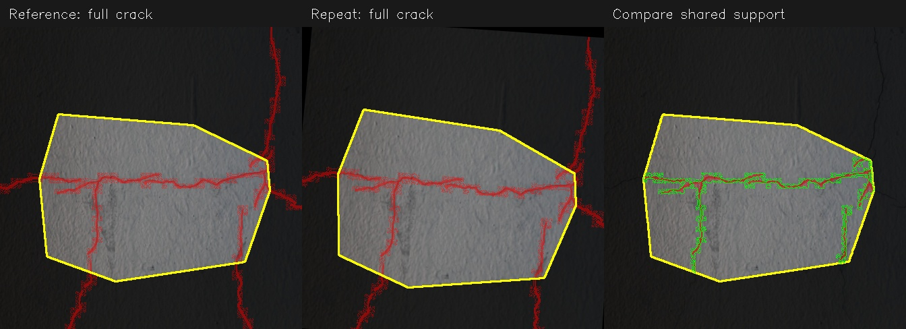

# Temporal coverage fix and learned-feature evaluation

The coverage fix recovers 145/190 transformed defect IDs with ORB, versus 0 in the original run. SuperPoint + LightGlue recovers 174/190 using the same rule, with 11.8× the total CPU query time in this implementation. These are synthetic repeat views, not evidence of seasonal reliability.

100 test images, 400 queries per matcher, identical synthetic GPS and transformations.

## Defect identity results

| Scenario | ORB correct IDs | LightGlue correct IDs | ORB unresolved | LightGlue unresolved |
|---|---:|---:|---:|---:|
| identity | 84 | 93 | 11 | 2 |
| view | 75 | 86 | 20 | 9 |
| view_lighting | 70 | 88 | 25 | 7 |
| wrong_place | 0 | 0 | 95 | 95 |

Each row reports the 95 images with nonempty ground-truth masks. Five empty-mask images are excluded from identity rates, but included in alignment and timing. Raw JSON retains all 100 queries per scenario. Wrong-place controls should remain unresolved.

| Measure | ORB | SuperPoint + LightGlue |
|---|---:|---:|
| References with baseline IDs / 100 | 99 | 100 |
| Wrong existing IDs / 400 | 0 | 0 |
| New duplicate IDs / 400 | 0 | 0 |
| Median query time | 0.077 s | 0.812 s |
| 95th-percentile query time | 0.125 s | 1.223 s |
| Total query time | 29.4 s | 346.6 s |
| Compressed reference features | 3.58 MiB | 41.66 MiB |

Query timing includes feature extraction, GPS candidate retrieval, matching against all candidates,
coverage/overlap checks, and persistence. It excludes model loading, separate diagnostic alignment,
and image export. CPU only; OpenCV uses one thread and PyTorch uses two. These are practical
single-run measurements, not isolated hardware microbenchmarks.

## Frame alignment, before the damage decision

| Scenario | ORB aligned / 100 | LightGlue aligned / 100 |
|---|---:|---:|---:|
| identity | 99 | 100 |
| view | 94 | 99 |
| view_lighting | 89 | 99 |

| Scenario | ORB median supported mask fraction | LightGlue median supported mask fraction |
|---|---:|---:|
| identity | 76.0% | 93.6% |
| view | 68.2% | 88.2% |
| view_lighting | 67.8% | 87.2% |

Supported fractions are diagnostic source-hull coverage among successfully aligned true pairs.
A wider feature hull can improve identity recovery even without improving descriptor robustness.
This synthetic experiment does not establish cross-season performance.

## How the coverage fix works



Yellow outlines mark geometric support; darkened pavement is unsupported. Red is the reference/current annotation. In the right panel, green outlines show the aligned repeat mask inside shared support. The comparison uses only that shared region.

1. GPS retrieves nearby reference frames. Feature matching and RANSAC estimate the road-plane homography.
2. The source and reference inlier hulls are intersected in reference coordinates. This defines shared geometric support.
3. At least 25% of each original damage mask and 64 foreground pixels must lie in that support. A small sliver cannot establish identity.
4. Both masks and skeletons are clipped to shared support before the existing tolerant overlap comparison: three pixels, 60% match threshold, 25–60% ambiguous.
5. One unambiguous matching ID is reused. Competing IDs remain unresolved. New IDs still require full support for the current mask.

The old rule required the entire current mask to be supported before any comparison. The original benchmark recovered 1/100 unchanged IDs and 0/100 in each transformed group.
The revised code permits partial evidence for identity without treating unseen pixels as absent damage.

## What the learned matcher changes

The optional adapter uses pretrained SuperPoint to extract up to 1,500 points and float descriptors, then LightGlue to pair them.
ORB also uses a 1,500-feature cap. Both feed the same RANSAC, coverage, overlap, ambiguity, and storage code.
Features are extracted at original resolution; learned points are filtered to the road ROI. Image dimensions are saved with features.
Separate freshly built databases prevent mixing incompatible descriptors. ORB remains the production default; learned dependencies are evaluation-only.

## Scope and limitations

- The same 100 images previously used to diagnose the coverage failure are reused here. This is a paired development evaluation, not a fresh independent holdout.
- The inherited harness creates an empty observation for five blank masks. Those cases are excluded from identity results; their empty reference masks contribute zero overlap to other queries. Raw enrollment counts include these artificial empty observations. The harness now emits no damage for empty masks; benchmark_used.py preserves the exact evaluated harness, and a regression test protects the correction.
- Ground-truth masks are transformed with the photos; one complete binary annotation is one observation, which can include several crack branches. No segmentation inference is evaluated.
- Random planar viewpoint changes: roll ±5°, pitch/yaw ±2°, scale 0.95–1.05, shifts ±2.5%. Lighting cases add gain 0.85–1.15, offset ±10, and mild Gaussian blur.
- Synthetic GPS is spaced 20 m apart with reported 5 m accuracy and 2 m query jitter. Each query sees 4–7 candidate references. Real nearby imagery may be more confusing.
- References are enrolled independently and then pooled. Queries never become references for subsequent queries.
- The hull is geometric support, not a visibility detector. Vehicles, snow, shadows, and genuine seasonal changes are not handled or validated by this fix.
- Crack-growth identity remains limited by symmetric overlap. No growth or repair inference was added.
- The quarter-mask/64-pixel thresholds are heuristics fixed before comparing matchers; pixel thresholds depend on resolution.
- Zero observed wrong matches is not proof that false associations cannot occur.

## Reproduction

Run from the engine directory, choosing fresh output folders:

```sh
uv sync
python -m src.tests.benchmarks.temporal_dataset --count 100 --seed 20260910 --matcher orb --output reports/comparison-rerun/orb
python -m src.tests.benchmarks.temporal_dataset --count 100 --seed 20260910 --matcher lightglue --device cpu --output reports/comparison-rerun/lightglue
python -m src.tests.benchmarks.summarize_temporal reports/comparison-rerun
```

The learned model package is pinned to official LightGlue commit eb42fee2d71449efb0aa5c10549752b5d75384d8.
Each matcher directory contains manifest.json, results.json, summary.json, reference.sqlite, cases.jsonl, and transformed examples.
The paired-input checks verified all 400 source/transform/GPS/candidate-count records agree between matchers.

Implementation source: https://github.com/cvg/LightGlue

## Verification

All 44 tests passed with `.venv/bin/python -m unittest discover -s src/tests -p "test_*.py"`. The edge-crossing regression was observed failing before the fix and passing afterward. Tests also cover tiny/sliver rejection, ambiguity, partial-coverage novelty rejection, distinct defects, feature persistence, and empty-mask handling. `git diff --check` passed.

`environment.json` records runtime versions and pretrained-weight hashes. The default remains ORB; the optional learned adapter is available for evaluation. A real repeat survey and GPU measurements are the next evidence needed before deciding whether the extra cost is justified for deployment.

## Adoption after evaluation

SuperPoint + LightGlue is now the default `TemporalEngine` matcher. The production adapter lives in `src/engine/learned_features.py`, and `uv sync` installs its pinned dependency. The default selects CUDA when available, otherwise CPU. The benchmark results above describe the evaluated implementations; ORB remains available for explicit comparison runs.
